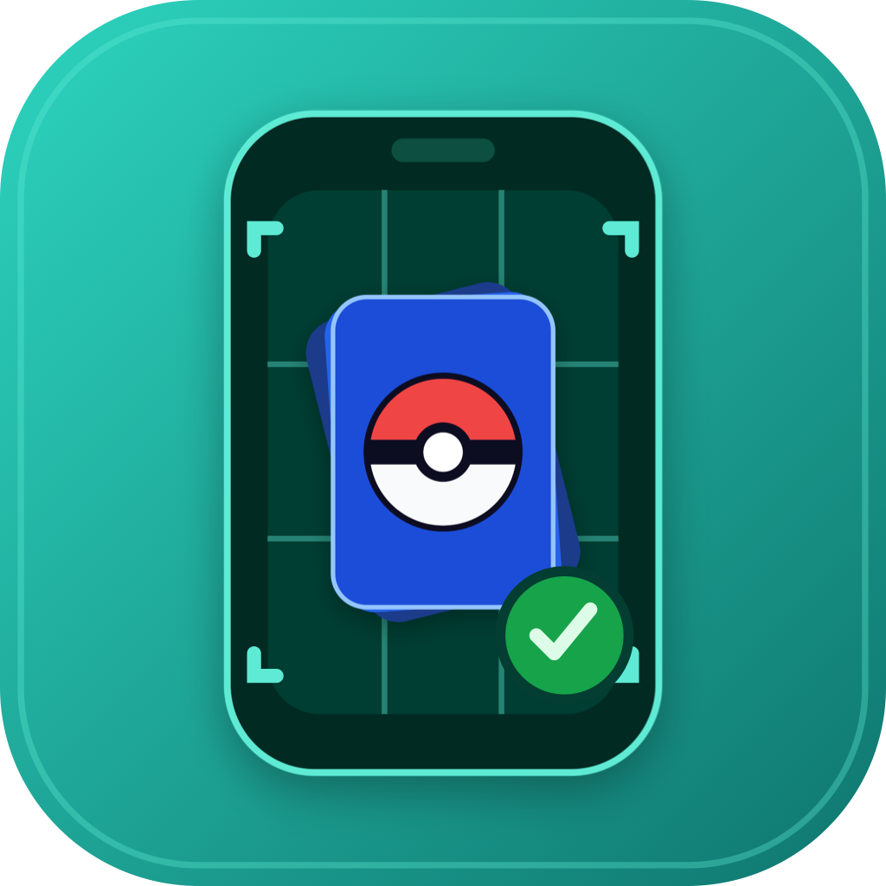

<p align="center">
  
</p>

<h1 align="center">DeckCheck</h1>

A personal **Pokémon TCG inventory** iOS app. Snap your cards to add them, snap the
ones you trade away to remove them, and paste a decklist to see exactly what you're
missing — with reprints and alternate arts counted as interchangeable copies.

DeckCheck is **single-user and self-hosted**: each person runs their own copy against
**their own Google Sheet**. There is no shared server, no account system, and nothing
hosted by anyone else. It's distributed as MIT-licensed source that you build and
sideload yourself.

> **Not affiliated with Pokémon.** DeckCheck is an unofficial, fan-made tool. It is not
> produced, endorsed, sponsored by, or associated with Nintendo, The Pokémon Company,
> Creatures Inc., GAME FREAK, or Wizards of the Coast. "Pokémon" and all card names are
> trademarks of their respective owners; they're used here only descriptively to
> identify the cards you own. DeckCheck ships **no card data and no card images** — you
> build your own catalog from a third-party source (see below).

---

## How it works

```
Camera → Apple Vision (OCR)      ┌──────────────────────────────┐
     reads name / number / set → │  Catalog (local SQLite)       │  self-built,
     resolve-to-printing ──────► │  facts + precomputed          │  read-only,
                                 │  equivalence keys             │  never in the Sheet
Confirm / correct (batch review) └──────────────────────────────┘
     │
     ▼
Durable outbox ──► Google Sheets API (values.batchUpdate)   auth = YOUR OAuth token
Local read-cache ◄─ values.get      reconciliation runs on-device (Swift)
                         │
                         ▼
              Google Sheet = your inventory DB  (in your own Drive, hand-editable)
```

- **The inventory is your own Google Sheet**, connected via the Google Sheets API with
  your own OAuth token (PKCE, public client — no secret). Scopes are minimal:
  `spreadsheets` + `drive.file` only. It's fully hand-editable from a laptop.
- **The catalog is a local, read-only SQLite snapshot** you build yourself. It holds
  card facts, image URLs, and a precomputed *equivalence key* per card (the phone never
  hashes — it looks up). The catalog is never written into the Sheet.
- **Decklist gap-check** parses a TCG Live "Copy List", resolves each line, diffs it
  against what you own by equivalence group, and produces a gap-first report with a
  one-paste TCGplayer buy list. It can also run **in your browser with the app closed**
  as an optional add-on — see [`docs/setup/browser-gap-check.md`](docs/setup/browser-gap-check.md).

## Repo layout

| Path | What |
|---|---|
| `ios/DeckCheck/` | the SwiftUI app (camera, OCR, outbox, read-cache, Sheets/OAuth device shell) |
| `DeckCheckCore/` | Swift package: the pure engines — resolve, gap-check, search, the Sheets/OAuth/Apps-Script request builders — plus a `DeckCheckSQLite` catalog reader and a `gapcheck` CLI. Heavily unit-tested; the device shell stays thin. |
| `tools/build-catalog/` | Node/TypeScript catalog builder — turns a card-data source into the local `catalog.sqlite` |
| `docs/setup/` | one-time setup guides (OAuth client, on-device testing, in-browser gap-check) |

## Recipe, not the meal

This repo ships **code + a catalog-build pipeline + docs — never the catalog data and
never card art.** You build your own local catalog from your own source. `catalog.sqlite`
is a git-ignored build artifact.

## Build & run

**1. Build your catalog snapshot** (Node 18+). The builder sources card data from
[TCGdex](https://tcgdex.dev) (MIT-licensed, no API key):

```sh
cd tools/build-catalog
npm install
npm run build -- --out ../../ios/DeckCheck/catalog.sqlite --cache-dir ./cache
```

`--cache-dir` persists per-card JSON so rebuilds are cheap.

**2. Set up your own Google OAuth client** (~10 min, one-time) — see
[`docs/setup/google-oauth-client.md`](docs/setup/google-oauth-client.md). You get a
single iOS client ID that you paste into the app; no client secret.

**3. Open and run the app:**

```sh
open ios/DeckCheck.xcodeproj
```

- Set your **signing team** on the `DeckCheck` target (a free Apple ID works). Copy
  `ios/Config/Local.xcconfig.example` → `ios/Config/Local.xcconfig` and set your Team
  ID there — it's git-ignored, so it never lands in version control. Change the bundle
  id from `com.example.DeckCheck` to your own.
- Confirm `catalog.sqlite` is in the `DeckCheck` target (the file-system-synchronized
  group picks it up once it's in the folder).
- Plug in your iPhone and **Run**. In the app, connect your inventory Sheet
  (sign in with Google → it creates/links your Sheet).

## Develop & test

```sh
# Pure engines — fast, no device or Google account needed:
cd DeckCheckCore
DEVELOPER_DIR=/Applications/Xcode.app/Contents/Developer swift test

# Compile-check the app:
DEVELOPER_DIR=/Applications/Xcode.app/Contents/Developer xcodebuild \
  -project ios/DeckCheck.xcodeproj -scheme DeckCheck \
  -destination 'generic/platform=iOS Simulator' CODE_SIGNING_ALLOWED=NO build

# Run the gap-check / search engines from the laptop over a catalog snapshot:
swift run gapcheck --help
```

The design pattern throughout: build testable logic in `DeckCheckCore` first, keep the
device shell thin.

## License

[MIT](LICENSE) — © 2026 jpsturgis. Do what you like; no warranty. See the
non-affiliation notice at the top of this file.
