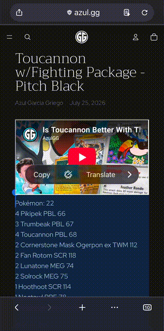
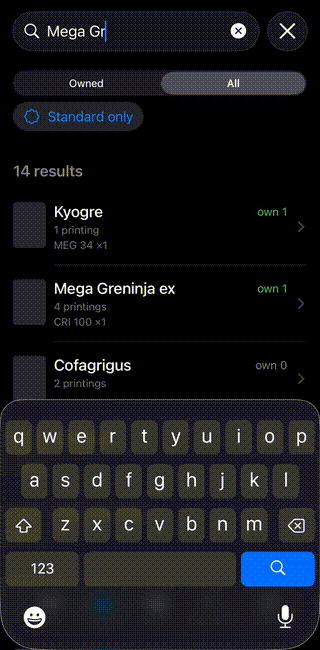

<p align="center">
  
</p>

<h1 align="center">DeckCheck</h1>

<p align="center"><em>Track your Pokémon TCG collection on your phone, and know exactly what you're missing to build a deck — backed by a Google Sheet you own.</em></p>

<p align="center">
  <a href="https://github.com/jpsturgis/deckcheck/actions/workflows/ci.yml"></a>
</p>

## What it solves

- **"Do I already own this card?"** — search your whole collection from your phone in seconds.
- **"What do I still need to build this deck?"** — paste a decklist (TCG Live "Copy List") and get a gap-first report plus a one-paste **TCGplayer buy list**. **Reprints and alternate arts count as the same card**, so it never tells you to buy something you already own in a different printing.
- **"Logging cards by hand is tedious."** — snap a photo of a stack to bulk-**add** them; snap the ones you trade away to **remove** them. Apple Vision reads each card — you just confirm.
- **"I don't want my collection trapped in someone's app."** — your inventory is a plain **Google Sheet in your own Drive**: hand-editable, sortable, exportable, and still yours if you ever stop using DeckCheck.

**→ [User guide](docs/usage.md)** — how every tab works (Scan · Cards · Decks · Gap Check · Settings).

## Screenshots

<table>
  <tr>
    <td align="center"><br><sub>Snap to add cards</sub></td>
    <td align="center"><br><sub>Decklist gap-check + buy list</sub></td>
    <td align="center"><br><sub>Search your collection</sub></td>
  </tr>
</table>

DeckCheck is **single-user and self-hosted**: each person runs their own copy against
**their own Google Sheet**. There is no shared server, no account system, and nothing
hosted by anyone else. It's distributed as MIT-licensed source that you build and
sideload yourself.

> **Not affiliated with Pokémon.** DeckCheck is an unofficial, fan-made tool. It is not
> produced, endorsed, sponsored by, or associated with Nintendo, The Pokémon Company,
> Creatures Inc., GAME FREAK, or Wizards of the Coast. "Pokémon" and all card names are
> trademarks of their respective owners; they're used here only descriptively to
> identify the cards you own. DeckCheck ships **no card data and no card images** — you
> build your own catalog from a third-party source (see below).

---

## How it works

```
Camera → Apple Vision (OCR)      ┌──────────────────────────────┐
     reads name / number / set → │  Catalog (local SQLite)       │  self-built,
     resolve-to-printing ──────► │  facts + precomputed          │  read-only,
                                 │  equivalence keys             │  never in the Sheet
Confirm / correct (batch review) └──────────────────────────────┘
     │
     ▼
Durable outbox ──► Google Sheets API (values.batchUpdate)   auth = YOUR OAuth token
Local read-cache ◄─ values.get      reconciliation runs on-device (Swift)
                         │
                         ▼
              Google Sheet = your inventory DB  (in your own Drive, hand-editable)
```

- **The inventory is your own Google Sheet**, connected via the Google Sheets API with
  your own OAuth token (PKCE, public client — no secret). Scopes are minimal:
  `spreadsheets` + `drive.file` only. It's fully hand-editable from a laptop.
- **The catalog is a local, read-only SQLite snapshot** you build yourself. It holds
  card facts, image URLs, and a precomputed *equivalence key* per card (the phone never
  hashes — it looks up). The catalog is never written into the Sheet.
- **Decklist gap-check** parses a TCG Live "Copy List", resolves each line, diffs it
  against what you own by equivalence group, and produces a gap-first report with a
  one-paste TCGplayer buy list. It can also run **in your browser with the app closed**
  as an optional add-on — see [`docs/setup/browser-gap-check.md`](docs/setup/browser-gap-check.md).

## Repo layout

| Path | What |
|---|---|
| `ios/DeckCheck/` | the SwiftUI app (camera, OCR, outbox, read-cache, Sheets/OAuth device shell) |
| `DeckCheckCore/` | Swift package: the pure engines — resolve, gap-check, search, the Sheets/OAuth/Apps-Script request builders — plus a `DeckCheckSQLite` catalog reader and a `gapcheck` CLI. Heavily unit-tested; the device shell stays thin. |
| `tools/build-catalog/` | Node/TypeScript catalog builder — turns a card-data source into the local `catalog.sqlite` |
| `docs/setup/` | one-time setup guides (OAuth client, on-device testing, in-browser gap-check) |

## Recipe, not the meal

This repo ships **code + a catalog-build pipeline + docs — never the catalog data and
never card art.** You build your own local catalog from your own source. `catalog.sqlite`
is a git-ignored build artifact.

## Build & run

DeckCheck isn't on the App Store — you **build it in Xcode and run it on your own
iPhone** (a "sideload"). A **free Apple ID works** (no paid Apple Developer account
needed). You'll need: a **Mac with Xcode**, **Node 18+**, and an iPhone you can put into
**Developer Mode**. Free-account catch: apps signed with a free Apple ID **stop
launching after 7 days** — just re-run from Xcode to refresh.

**1. Build your catalog snapshot** (Node 18+). The builder sources card data from
[TCGdex](https://tcgdex.dev) (MIT-licensed, no API key):

```sh
cd tools/build-catalog
npm install
npm run build -- --out ../../ios/DeckCheck/catalog.sqlite --cache-dir ./cache
```

`--cache-dir` persists per-card JSON so rebuilds are cheap.

**2. Open the project and set up signing.** Do this *before* step 3 — creating the
OAuth client needs your bundle id.

```sh
open ios/DeckCheck.xcodeproj
```

- Select the **DeckCheck** target → **Signing & Capabilities** → check **Automatically
  manage signing** → pick your **Team** (your free Apple ID; add it under Xcode →
  Settings → Accounts if it isn't listed). You **must** select a Team here — the app
  won't build without one.
- Set a **unique Bundle Identifier** (Apple requires it to be unique to sign): change
  `com.example.DeckCheck` to e.g. `com.yourname.deckcheck`. **Note this value — step 3
  needs it.**
- Confirm `catalog.sqlite` is in the **DeckCheck** target (the file-system-synchronized
  group picks it up once it's in the folder).

  <sub>Picking a Team writes your Team ID into the project file — fine for your own copy.
  If you'll commit a fork and want to keep your Team ID out of git, put it in
  `ios/Config/Local.xcconfig` (copy the `.example`) instead; you still pick the Team in
  Xcode once so it can provision your device.</sub>

**3. Set up your own Google OAuth client** (~10 min, one-time) — follow
[`docs/setup/google-oauth-client.md`](docs/setup/google-oauth-client.md), using the
**bundle id from step 2**. You end up with a single iOS **Client ID** (no client secret)
to paste into the app.

**4. Run on your iPhone and connect your Sheet.**

- On the iPhone, enable **Developer Mode**: Settings → **Privacy & Security** →
  **Developer Mode** → on → restart. (Leave it on; it only needs to be on to run your own
  builds.)
- Plug in the iPhone, select it as the run destination in Xcode, and **Run** (▶).
- The first launch is blocked as an *untrusted developer*. On the iPhone: Settings →
  **General → VPN & Device Management** → tap your developer profile → **Trust**, then
  reopen the app.
- In the app: **Settings → Inventory Sheet** → paste your **Client ID** → **Sign in with
  Google** → **Create my Inventory sheet**. That creates the Sheet in your Drive — done.

Then see the **[User guide](docs/usage.md)** for how each tab works.

**Optional — in-browser / app-closed gap-check.** Once connected, you can enable a mode
that runs the decklist gap-check in your browser with the app closed. It's off by default
and adds one Google permission — see
[`docs/setup/browser-gap-check.md`](docs/setup/browser-gap-check.md).

## Develop & test

```sh
# Pure engines — fast, no device or Google account needed:
cd DeckCheckCore
DEVELOPER_DIR=/Applications/Xcode.app/Contents/Developer swift test

# Compile-check the app:
DEVELOPER_DIR=/Applications/Xcode.app/Contents/Developer xcodebuild \
  -project ios/DeckCheck.xcodeproj -scheme DeckCheck \
  -destination 'generic/platform=iOS Simulator' CODE_SIGNING_ALLOWED=NO build

# Run the gap-check / search engines from the laptop over a catalog snapshot:
swift run gapcheck --help
```

The design pattern throughout: build testable logic in `DeckCheckCore` first, keep the
device shell thin.

## Support

DeckCheck is free and MIT-licensed. If it's useful to you and you'd like to help with its
development, you can **[sponsor on GitHub](https://github.com/sponsors/jpsturgis)** or
**[buy me a coffee on Ko-fi](https://ko-fi.com/jpsturgis)**. Entirely optional — it goes
toward the app's development, nothing else. Thank you!

## License

[MIT](LICENSE) — © 2026 jpsturgis. Do what you like; no warranty. See the
non-affiliation notice at the top of this file.
